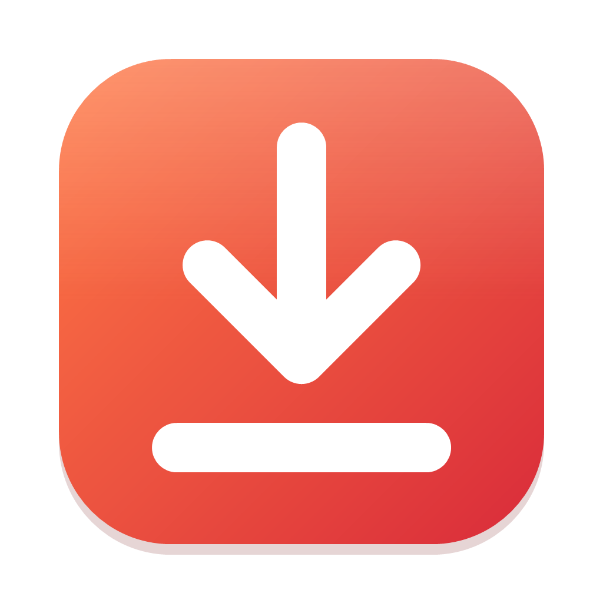

<div align="center">



# VidSave

**A small, simple desktop app for downloading YouTube videos and audio, for Windows and macOS.**

[](https://github.com/meirlamdan/vidsave/releases/latest)
[](https://github.com/meirlamdan/vidsave/actions/workflows/release.yml)
[](https://github.com/meirlamdan/vidsave/releases)

[**⬇ Download the latest version**](https://github.com/meirlamdan/vidsave/releases/latest) · [עברית](#עברית)

</div>

---

## Features

- **Video or audio**: MP4 / MKV / WEBM in any available quality (up to 4K), or MP3 / M4A / OPUS / FLAC / WAV.
- **Playlists**: paste a playlist link and pick which videos to download.
- **Trim**: download only part of a video (start / end time).
- **Extras**: subtitles, thumbnail and metadata embedding, SponsorBlock (skips sponsor segments).
- **Several downloads at once**, with a queue and history.
- **Paste and go**: copy a link and VidSave picks it up when you switch back to the window. You can also drag a link onto the window.
- **8 languages**: English, עברית, العربية, Español, Français, Deutsch, Русский, Português.
- **Updates itself**: when a new version comes out, the app offers to install it with one click.
- **Tiny**: about 6 MB. No installer, no admin rights needed.

## Download

Go to the [**latest release**](https://github.com/meirlamdan/vidsave/releases/latest) and pick the file for your computer:

| Your computer | File |
|---|---|
| Windows 10 / 11 | `vidsave-<version>-win.zip` |
| Mac with Apple Silicon (M1, M2, M3, M4…) | `vidsave-<version>-macos-arm64.dmg` |
| Mac with an Intel processor | `vidsave-<version>-macos-x86_64.dmg` |

> Not sure which Mac you have? Apple menu → **About This Mac**. If "Chip" says *Apple M…*, use **arm64**. If it says "Processor … Intel", use **x86_64**.

### Windows

1. Download the `-win.zip` file and **extract** it (right-click → *Extract All…*) to a permanent place, for example `Documents\VidSave`.
2. Open the folder and run **`vidsave.exe`**.
3. Windows may show *"Windows protected your PC"*, because the app isn't signed with a paid certificate. Click **More info → Run anyway**. This happens only the first time.

Tip: right-click `vidsave.exe` → *Send to → Desktop (create shortcut)*.

### macOS (macOS 15 or newer)

1. Open the `.dmg` and drag **VidSave** into **Applications**.
2. Open VidSave. The first time, macOS will say it *"cannot verify"* the app, because it isn't notarized by Apple.
   Go to **System Settings → Privacy & Security**, scroll down, and click **Open Anyway** next to VidSave.
   Alternatively, run this once in Terminal:
   ```sh
   xattr -cr /Applications/VidSave.app
   ```

### First run

VidSave uses [yt-dlp](https://github.com/yt-dlp/yt-dlp) and [ffmpeg](https://ffmpeg.org). On first launch it downloads them automatically into its own folder. Nothing is installed system-wide. If you already have ffmpeg installed, VidSave uses yours.

If YouTube changes something and downloads stop working, open **Settings → yt-dlp → Update**.

## Updates

VidSave checks for a new version every time it starts. When one is available, a bar appears at the top. Click **Install & restart** and you're done. You can also check by hand in **Settings → App → Check for updates**.

## Building from source

VidSave is built with [tinyjs](https://tinyjs.app): a JavaScript backend (txiki.js) plus the system's native web view.

```sh
# install tinyjs
curl -fsSL https://tinyjs.app/install | sh          # macOS / Linux
irm https://tinyjs.app/install.ps1 | iex            # Windows (PowerShell)

# run with hot reload
tinyjs dev

# build (dist/)
tinyjs build
```

Project layout:

```
tinyjs.json         app config (name, version, update URL)
src/main.js         backend: runs yt-dlp / ffmpeg, reports progress
src/frontend/       the UI (index.html, app.js, i18n.js, style.css)
.github/workflows/  automatic builds + releases
```

### Releasing a new version

Push a version tag. GitHub Actions builds Windows + macOS (Apple Silicon and Intel), creates the release, and publishes the update manifest that existing installs check:

```sh
git tag v1.0.1
git push origin v1.0.1
```

The version number comes from the tag, so there's no need to edit `tinyjs.json`.

## Disclaimer

Download only content you own or have permission to download, and respect YouTube's Terms of Service and copyright law in your country.

## License

[MIT](LICENSE)

---

<div dir="rtl">

## עברית

**VidSave** היא תוכנה קטנה ופשוטה להורדת סרטונים ושמע מיוטיוב, לוינדוס ולמק.

### הורדה

נכנסים ל[**גרסה האחרונה**](https://github.com/meirlamdan/vidsave/releases/latest) ובוחרים את הקובץ המתאים:

- **וינדוס:** את הקובץ `-win.zip` מחלצים לתיקייה קבועה ומפעילים את `vidsave.exe`. אם מופיעה ההודעה "Windows protected your PC", לוחצים **More info** ואז **Run anyway**.
- **מק עם שבב Apple (M1/M2/M3/M4):** הקובץ `macos-arm64.dmg`.
- **מק עם מעבד Intel:** הקובץ `macos-x86_64.dmg`.
  במק גוררים את האפליקציה לתיקיית Applications. בפתיחה הראשונה נכנסים ל־**System Settings ← Privacy & Security** ולוחצים **Open Anyway**.

בהפעלה הראשונה התוכנה מורידה לבד את הרכיבים שהיא צריכה (yt-dlp ו־ffmpeg).

### עדכונים

בכל הפעלה התוכנה בודקת אם יצאה גרסה חדשה. אם כן, מופיע למעלה פס עם כפתור **התקן והפעל מחדש**. אפשר גם לבדוק ידנית דרך **הגדרות ← התוכנה ← בדוק עדכונים**.

</div>
